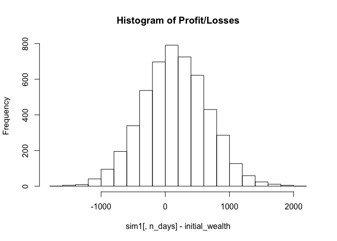

Predictive Modeling Question Set
--------------------------------

Visual Story telling part 1: Green Buildings
--------------------------------------------

In this analysis we investigate the economic impact of going green for a
new construction project. The building of interest is a 15-story
mixed-use building on East Cesar Chavez. Construction costs are $100
million, with a 5% expected premium for green certification. The data
was cleaned to remove records with missing values and outliers. The
feature column empl\_gr contained both missing values and outliers.
Feature column leasing\_rate contained records with very low leasing
rates, hence, buildings with leasing rates &lt;10% were removed from the
analysis. Initially analysis shows.

    green = read.csv("/Users/dandichen/Desktop/Stats\ Summer\ 2019/STA380/data/greenbuildings.csv")
    library(dplyr)

    ## 
    ## Attaching package: 'dplyr'

    ## The following objects are masked from 'package:stats':
    ## 
    ##     filter, lag

    ## The following objects are masked from 'package:base':
    ## 
    ##     intersect, setdiff, setequal, union

    library(ggplot2)
    library(tidyverse)

    ## ── Attaching packages ─────────────────────────────────────────────────────── tidyverse 1.2.1 ──

    ## ✔ tibble  2.1.3     ✔ purrr   0.3.2
    ## ✔ tidyr   0.8.3     ✔ stringr 1.4.0
    ## ✔ readr   1.3.1     ✔ forcats 0.4.0

    ## ── Conflicts ────────────────────────────────────────────────────────── tidyverse_conflicts() ──
    ## ✖ dplyr::filter() masks stats::filter()
    ## ✖ dplyr::lag()    masks stats::lag()

    library(knitr)
    attach(green)

    # convert categorical flags to factors 
    green$cluster = as.factor(green$cluster)
    green$green_rating = as.factor(green$green_rating)
    green$Energystar = as.factor(green$Energystar)
    green$LEED = as.factor(green$LEED)
    green$net = as.factor(green$net)
    green$amenities = as.factor(green$amenities)

    # drop rows with NA in the empl_gr
    green = na.omit(green)

    # something weird with growth rate values 
    # very high and low outliers?
    # remove from analysis 
    # -24.950, 67.780 
    green = green[green$empl_gr != -24.950,]
    green = green[green$empl_gr != 67.780,]

    # remove data point where leasing rate is less then 10%
    green = green[green$leasing_rate > 10,]


With a density plot we see that overall, rents are generally higher in
green builings. - Non-Greem(0) and Green(1)


<table>
<thead>
<tr class="header">
<th style="text-align: left;">green_rating</th>
<th style="text-align: right;">mean_rents</th>
</tr>
</thead>
<tbody>
<tr class="odd">
<td style="text-align: left;">0</td>
<td style="text-align: right;">28.47395</td>
</tr>
<tr class="even">
<td style="text-align: left;">1</td>
<td style="text-align: right;">30.05255</td>
</tr>
</tbody>
</table>

With the boxplot, again, we see overall rents are higher in green
buildings. Summary staistics reveal higher rents in Green Buildings.-
Non-Greem(0) and Green(1)

Next, Leasing Rates were investigated


<table>
<thead>
<tr class="header">
<th style="text-align: left;">green_rating</th>
<th style="text-align: right;">mean_leasing_rate</th>
</tr>
</thead>
<tbody>
<tr class="odd">
<td style="text-align: left;">0</td>
<td style="text-align: right;">84.51331</td>
</tr>
<tr class="even">
<td style="text-align: left;">1</td>
<td style="text-align: right;">89.24362</td>
</tr>
</tbody>
</table>

We can see leasing rates are higher in green buildings. - Non-Greem(0)
and Green(1)

In addtion, we can look at leasing rates vs rents, delininated by
Non-Greem(0) and Green(1)


We have higher leasing rates and higher rents.

Shifting gears, we take a look at the ages of buildings and the effect
is has on rents


We see that Green buildings are younger in each building class type.


Looking at by - Non-Greem(0) and Green(1) - and fitting a regression
line we see that rents might slightly decline over time in Non-Green
Buildings and possibly increase or remain flat as a Green building ages.

Further investigating the data, Year-on-Year employment growth rate
revealed findings to be considered.


<table>
<thead>
<tr class="header">
<th style="text-align: left;">green_rating</th>
<th style="text-align: right;">mean_emp_rate</th>
</tr>
</thead>
<tbody>
<tr class="odd">
<td style="text-align: left;">0</td>
<td style="text-align: right;">2.281094</td>
</tr>
<tr class="even">
<td style="text-align: left;">1</td>
<td style="text-align: right;">2.538906</td>
</tr>
</tbody>
</table>

Green buildings are genearlly built in area with higher Year-on-Year
employment growth rates. If the Austin should have Employment of at
least 2.538

At this point in the analysis, we were initially ready to endorse the
original analysts’ findings. Further investigating the data and sub
setting by building class revealed eye opening insights.

Summary statistics of mean rents based on Class A Buildings are shown
below.

<table>
<thead>
<tr class="header">
<th style="text-align: left;">green_rating</th>
<th style="text-align: right;">mean_rent</th>
</tr>
</thead>
<tbody>
<tr class="odd">
<td style="text-align: left;">0</td>
<td style="text-align: right;">32.63734</td>
</tr>
<tr class="even">
<td style="text-align: left;">1</td>
<td style="text-align: right;">30.99438</td>
</tr>
</tbody>
</table>

Strikingly, we see Green Buildings - Non-Greem(0) and Green(1) - in the
Class A category have lower mean rents.

Summary statistics of mean rents based on Class B Buildings are shown
below.

<table>
<thead>
<tr class="header">
<th style="text-align: left;">green_rating</th>
<th style="text-align: right;">mean_rent</th>
</tr>
</thead>
<tbody>
<tr class="odd">
<td style="text-align: left;">0</td>
<td style="text-align: right;">26.57549</td>
</tr>
<tr class="even">
<td style="text-align: left;">1</td>
<td style="text-align: right;">26.22729</td>
</tr>
</tbody>
</table>

Green Buildings in the Class B category have lower mean rents as well.

Summary statistics of mean rents based on Class C Buildings are shown
below.

<table>
<thead>
<tr class="header">
<th style="text-align: left;">green_rating</th>
<th style="text-align: right;">mean_rent</th>
</tr>
</thead>
<tbody>
<tr class="odd">
<td style="text-align: left;">0</td>
<td style="text-align: right;">24.29293</td>
</tr>
<tr class="even">
<td style="text-align: left;">1</td>
<td style="text-align: right;">30.20000</td>
</tr>
</tbody>
</table>

Green Buildings in the Class C category have Higher mean rents as well.

Finally, the mean leasing rate of Non-Green(0) vs Green Buildings(1) was
analyzed.

<table>
<thead>
<tr class="header">
<th style="text-align: left;">green_rating</th>
<th style="text-align: right;">mean_rent</th>
</tr>
</thead>
<tbody>
<tr class="odd">
<td style="text-align: left;">0</td>
<td style="text-align: right;">88.42732</td>
</tr>
<tr class="even">
<td style="text-align: left;">1</td>
<td style="text-align: right;">89.98237</td>
</tr>
</tbody>
</table>

We see green buildings have 1.56% higher leasing rates.

Our analysis revealed the important consideration of Building Class. If
the intended Building Class is of type A then going green is not
advised. The analysis revealed mean rents $1.7 per/square foot lower
than non-green buildings. If the intended Building Class is of type B
then going green is not advised. Mean rents $0.3 per/square foot lower
than non-green buildings. If on the other hand the Building Class is
intended to be of type C then going green is advised. Mean rents are 5.7
per/square foot higher than non-green buildings.

In conclusion, we wouldn’t recommend going green unless the building
class of type C.

------------------------------------------------------------------------

Problem 2:
==========

(1) Data Cleaning
-----------------

From the summary statistics, firstly we can see `CarrierDelay`,
`WeatherDelay`, `NASDelay`, `SecurityDelay` and `LateAircraftDelay` have
a lot of missing values and these columns should be excluded from the
dataset. Secondly, there are some missing value in other features and we
would like to drop any rows with missing values. After removing rows
with missing values, `Cancelled`, `CancellationCode` and `Diverted` are
all 0. Thus, we decide to remove them too.

    ABIA <- read.csv("/Users/dandichen/Desktop/Stats\ Summer\ 2019/STA380/data/ABIA.csv")
    #str(ABIA)
    summary(ABIA)

    ##       Year          Month         DayofMonth      DayOfWeek    
    ##  Min.   :2008   Min.   : 1.00   Min.   : 1.00   Min.   :1.000  
    ##  1st Qu.:2008   1st Qu.: 3.00   1st Qu.: 8.00   1st Qu.:2.000  
    ##  Median :2008   Median : 6.00   Median :16.00   Median :4.000  
    ##  Mean   :2008   Mean   : 6.29   Mean   :15.73   Mean   :3.902  
    ##  3rd Qu.:2008   3rd Qu.: 9.00   3rd Qu.:23.00   3rd Qu.:6.000  
    ##  Max.   :2008   Max.   :12.00   Max.   :31.00   Max.   :7.000  
    ##                                                                
    ##     DepTime       CRSDepTime      ArrTime       CRSArrTime  
    ##  Min.   :   1   Min.   :  55   Min.   :   1   Min.   :   5  
    ##  1st Qu.: 917   1st Qu.: 915   1st Qu.:1107   1st Qu.:1115  
    ##  Median :1329   Median :1320   Median :1531   Median :1535  
    ##  Mean   :1329   Mean   :1320   Mean   :1487   Mean   :1505  
    ##  3rd Qu.:1728   3rd Qu.:1720   3rd Qu.:1903   3rd Qu.:1902  
    ##  Max.   :2400   Max.   :2346   Max.   :2400   Max.   :2400  
    ##  NA's   :1413                  NA's   :1567                 
    ##  UniqueCarrier     FlightNum       TailNum      ActualElapsedTime
    ##  WN     :34876   Min.   :   1          : 1104   Min.   : 22.0    
    ##  AA     :19995   1st Qu.: 640   N678CA :  195   1st Qu.: 57.0    
    ##  CO     : 9230   Median :1465   N511SW :  180   Median :125.0    
    ##  YV     : 4994   Mean   :1917   N526SW :  176   Mean   :120.2    
    ##  B6     : 4798   3rd Qu.:2653   N528SW :  172   3rd Qu.:164.0    
    ##  XE     : 4618   Max.   :9741   N520SW :  168   Max.   :506.0    
    ##  (Other):20749                  (Other):97265   NA's   :1601     
    ##  CRSElapsedTime     AirTime          ArrDelay           DepDelay      
    ##  Min.   : 17.0   Min.   :  3.00   Min.   :-129.000   Min.   :-42.000  
    ##  1st Qu.: 58.0   1st Qu.: 38.00   1st Qu.:  -9.000   1st Qu.: -4.000  
    ##  Median :130.0   Median :105.00   Median :  -2.000   Median :  0.000  
    ##  Mean   :122.1   Mean   : 99.81   Mean   :   7.065   Mean   :  9.171  
    ##  3rd Qu.:165.0   3rd Qu.:142.00   3rd Qu.:  10.000   3rd Qu.:  8.000  
    ##  Max.   :320.0   Max.   :402.00   Max.   : 948.000   Max.   :875.000  
    ##  NA's   :11      NA's   :1601     NA's   :1601       NA's   :1413     
    ##      Origin           Dest          Distance        TaxiIn       
    ##  AUS    :49623   AUS    :49637   Min.   :  66   Min.   :  0.000  
    ##  DAL    : 5583   DAL    : 5573   1st Qu.: 190   1st Qu.:  4.000  
    ##  DFW    : 5508   DFW    : 5506   Median : 775   Median :  5.000  
    ##  IAH    : 3704   IAH    : 3691   Mean   : 705   Mean   :  6.413  
    ##  PHX    : 2786   PHX    : 2783   3rd Qu.:1085   3rd Qu.:  7.000  
    ##  DEN    : 2719   DEN    : 2673   Max.   :1770   Max.   :143.000  
    ##  (Other):29337   (Other):29397                  NA's   :1567     
    ##     TaxiOut         Cancelled       CancellationCode    Diverted       
    ##  Min.   :  1.00   Min.   :0.00000    :97840          Min.   :0.000000  
    ##  1st Qu.:  9.00   1st Qu.:0.00000   A:  719          1st Qu.:0.000000  
    ##  Median : 12.00   Median :0.00000   B:  605          Median :0.000000  
    ##  Mean   : 13.96   Mean   :0.01431   C:   96          Mean   :0.001824  
    ##  3rd Qu.: 16.00   3rd Qu.:0.00000                    3rd Qu.:0.000000  
    ##  Max.   :305.00   Max.   :1.00000                    Max.   :1.000000  
    ##  NA's   :1419                                                          
    ##   CarrierDelay     WeatherDelay       NASDelay      SecurityDelay   
    ##  Min.   :  0.00   Min.   :  0.00   Min.   :  0.00   Min.   :  0.00  
    ##  1st Qu.:  0.00   1st Qu.:  0.00   1st Qu.:  0.00   1st Qu.:  0.00  
    ##  Median :  0.00   Median :  0.00   Median :  2.00   Median :  0.00  
    ##  Mean   : 15.39   Mean   :  2.24   Mean   : 12.47   Mean   :  0.07  
    ##  3rd Qu.: 16.00   3rd Qu.:  0.00   3rd Qu.: 16.00   3rd Qu.:  0.00  
    ##  Max.   :875.00   Max.   :412.00   Max.   :367.00   Max.   :199.00  
    ##  NA's   :79513    NA's   :79513    NA's   :79513    NA's   :79513   
    ##  LateAircraftDelay
    ##  Min.   :  0.00   
    ##  1st Qu.:  0.00   
    ##  Median :  6.00   
    ##  Mean   : 22.97   
    ##  3rd Qu.: 30.00   
    ##  Max.   :458.00   
    ##  NA's   :79513

    ABIA <- ABIA[, c(1:24)]
    ABIA <- ABIA[complete.cases(ABIA), ]
    ABIA <- ABIA[, c(1:21)] 

(2) Data Visualization
----------------------

From the below graphes, we can see the travel distance doesn’t vary a
lot among different month. Travel distances are longest during the
summer and shortest during the winter. The airplanes that depart at the
31st won’t travel as long as others. And Southwest Airline and American
Airline travel longest on average.

    library(ggplot2)
    # investigate month and mean distance
    ggplot(ABIA, aes(x=as.factor(Month), y=mean(Distance))) + 
      geom_col() + xlab("Month") + ylab("mean Distance")


    # investigate day of month and mean distance
    ggplot(ABIA, aes(x=as.factor(DayofMonth), y=mean(Distance))) + 
      geom_col() + xlab("DayofMonth)") + ylab("mean Distance")


    # investigate day of Week and mean distance
    ggplot(ABIA, aes(x=as.factor(DayOfWeek), y=mean(Distance))) + 
      geom_col() + xlab("DayofWeek)") + ylab("mean Distance")


    # invesigate airline and mean distance
    ggplot(ABIA, aes(x=UniqueCarrier, y=mean(Distance))) + 
      geom_col() + xlab("Carrier") + ylab("mean Distance")


Plot the top 10 origins and 10 destinations in IATA airport.

    library(ggplot2)
    library(dplyr)

    ABIA %>% 
      group_by(Origin) %>%
      summarize(count=n()) %>%
      arrange(desc(count)) %>% 
      top_n(10) %>%
      ggplot(aes(x=Origin, y=count)) +
      geom_col()

    ## Selecting by count


    ABIA %>% 
      group_by(Dest) %>%
      summarize(count=n()) %>%
      arrange(desc(count)) %>% 
      top_n(10) %>%
      ggplot(aes(x=Dest, y=count)) +
      geom_col()

    ## Selecting by count


Mutate the ABIA and constucted `DepLate`, `ArrLate` and `LapsedLong`
three dummy variables. `DepLate` variable is created by whether the
flight departed late. If it was, the value of this variable is 1. It is
same for the creation of `ArrLate` and `LapsedLong` variables.

    ABIA$DepLate <- rep(0, nrow(ABIA))
    ABIA$ArrLate <- rep(0, nrow(ABIA))
    ABIA$LapsedLong <- rep(0, nrow(ABIA))
    ABIA[ABIA$DepDelay > 0, ][, "DepLate"] <- 1
    ABIA[ABIA$DepDelay <= 0, ][, "DepLate"] <- 0
    ABIA[ABIA$ArrDelay > 0, ][, "ArrLate"] <- 1
    ABIA[ABIA$ArrDelay <= 0, ][, "ArrLate"] <- 0
    ABIA[(ABIA$CRSElapsedTime - ABIA$ActualElapsedTime) > 0, ][, "LapsedLong"] <- 0
    ABIA[(ABIA$CRSElapsedTime - ABIA$ActualElapsedTime) <= 0, ][, "LapsedLong"] <- 1

By calculate the number of delayed departure, arrival and excess Lapsed
travel flights for each Carrier, we figured out the every carrier is
less likely to depart late except for EV and WN. Basically, flights of
every carrier travel more time than they are described and their
probabilities of arriving late is around 0.5 except for DL, NW and OH.
Accounting for these three factors, it seems that US and 9E airline are
the two most reliable ones.

    library(dplyr)
    planeDelay <- group_by(ABIA, UniqueCarrier)
    delay <- summarize(planeDelay,
                       depLate_count = sum(DepLate),
                       depLate_percent = sum(DepLate)/n(),
                       arrLate_count = sum(ArrLate),
                       arrLate_percent = sum(ArrLate)/n(),
                       LapsedLong_count = sum(LapsedLong),
                       LapsedLong_percent = sum(LapsedLong)/n()
                       )
    delay_select <- select(delay,UniqueCarrier, depLate_percent, arrLate_percent, LapsedLong_percent)
    delay_select %>% 
      gather("Type", "Value", -UniqueCarrier) %>%
      ggplot(aes(UniqueCarrier,Value, fill=Type)) +
      geom_bar(position = "dodge", stat = "identity") +
      xlab("Carrier") + ylab("Percent")+
      theme_bw()


      #facet_wrap(~UniqueCarrier,scales = "free_x")

<table>
<colgroup>
<col style="width: 100%" />
</colgroup>
<tbody>
<tr class="odd">
<td style="text-align: left;">#3 Conservative Portfolio - All bonds - Looking for low risk</td>
</tr>
<tr class="even">
<td style="text-align: left;"># Portfolio Modeling part 3</td>
</tr>
<tr class="odd">
<td style="text-align: left;">## Low Risk / Safe Portfolio Consists of 5 EFTs with focus on government bonds. This portfolio is meant to minimize the risk of losses. EFTs selected: IEF, SHY, TLT, GOVT, SHV</td>
</tr>
<tr class="even">
<td style="text-align: left;"><code>r total_wealth</code></td>
</tr>
<tr class="odd">
<td style="text-align: left;"><code>## [1] 10050.48</code></td>
</tr>
<tr class="even">
<td style="text-align: left;"><code>r plot(wealthtracker, type='l')</code></td>
</tr>
<tr class="odd">
<td style="text-align: left;"></td>
</tr>
<tr class="even">
<td style="text-align: left;"><code>r hist(sim1[,n_days] - initial_wealth, 25, main = &quot;Histogram of Profit/Losses&quot;)</code></td>
</tr>
<tr class="odd">
<td style="text-align: left;"></td>
</tr>
<tr class="even">
<td style="text-align: left;"><code>r # 5% 20-day VaR VaR = round(sort(sim1[,n_days])[250] - initial_wealth, 2) paste0(&quot;The 5% 20-day VaR for this portfolio is a loss of: $&quot;, abs(VaR))</code></td>
</tr>
<tr class="odd">
<td style="text-align: left;"><code>## [1] &quot;The 5% 20-day VaR for this portfolio is a loss of: $170.95&quot;</code></td>
</tr>
<tr class="even">
<td style="text-align: left;">## High Risk / Aggressive Portfolio Consists of 5 EFTs focusing on technology companies. This portfolio is aggressive and is meant to maximize potential returns with an increased risk of losses. EFTs selected: XLK, VGT, IYW, IGV, IXN</td>
</tr>
<tr class="odd">
<td style="text-align: left;"><code>r total_wealth</code></td>
</tr>
<tr class="even">
<td style="text-align: left;"><code>## [1] 10890.58</code></td>
</tr>
<tr class="odd">
<td style="text-align: left;"><code>r plot(wealthtracker, type='l')</code></td>
</tr>
<tr class="even">
<td style="text-align: left;"></td>
</tr>
<tr class="odd">
<td style="text-align: left;"><code>r hist(sim1[,n_days] - initial_wealth, 25, main = &quot;Histogram of Profit/Losses&quot;)</code></td>
</tr>
<tr class="even">
<td style="text-align: left;"></td>
</tr>
<tr class="odd">
<td style="text-align: left;"><code>r # 5% 20-day VaR VaR = round(sort(sim1[,n_days])[250] - initial_wealth, 2) paste0(&quot;The 5% 20-day VaR for this portfolio is a loss of: $&quot;, abs(VaR))</code></td>
</tr>
<tr class="even">
<td style="text-align: left;"><code>## [1] &quot;The 5% 20-day VaR for this portfolio is a loss of: $668.46&quot;</code></td>
</tr>
<tr class="odd">
<td style="text-align: left;">## Diverse / Balanced Portfolio Consists of 5 EFTs balanced in different sectors. This is meant to serve as a middle ground between Low Risk and High Risk portfolios. The intent is to capture higher returns while still trying to minimize risk. EFTs selected: JPST - Money Market, USO - Oil and Gas, AGG - Total Bond, VNQ – Real Estate, GLD - Precious Metals.</td>
</tr>
<tr class="even">
<td style="text-align: left;"><code>r total_wealth</code></td>
</tr>
<tr class="odd">
<td style="text-align: left;"><code>## [1] 9866.698</code></td>
</tr>
<tr class="even">
<td style="text-align: left;"><code>r plot(wealthtracker, type='l')</code></td>
</tr>
<tr class="odd">
<td style="text-align: left;"></td>
</tr>
<tr class="even">
<td style="text-align: left;"><code>r hist(sim1[,n_days] - initial_wealth, 25, main = &quot;Histogram of Profit/Losses&quot;)</code></td>
</tr>
<tr class="odd">
<td style="text-align: left;"></td>
</tr>
<tr class="even">
<td style="text-align: left;"><code>r # 5% 20-day VaR VaR = round(sort(sim1[,n_days])[250] - initial_wealth, 2) paste0(&quot;The 5% 20-day VaR for this portfolio is a loss of: $&quot;, abs(VaR))</code></td>
</tr>
<tr class="odd">
<td style="text-align: left;"><code>## [1] &quot;The 5% 20-day VaR for this portfolio is a loss of: $255.9&quot;</code></td>
</tr>
</tbody>
</table>

Problem 4
=========

Read in the file first and scale all the columns(except for the first
column which includes the randomly generated number & letter
combination.

    marketing <- read.csv("/Users/dandichen/Desktop/Stats\ Summer\ 2019/STA380/data/social_marketing.csv")
    summary(marketing)

    ##          X           chatter       current_events      travel      
    ##  123pxkyqj:   1   Min.   : 0.000   Min.   :0.000   Min.   : 0.000  
    ##  12grikctu:   1   1st Qu.: 2.000   1st Qu.:1.000   1st Qu.: 0.000  
    ##  12klxic7j:   1   Median : 3.000   Median :1.000   Median : 1.000  
    ##  12t4msroj:   1   Mean   : 4.399   Mean   :1.526   Mean   : 1.585  
    ##  12yam59l3:   1   3rd Qu.: 6.000   3rd Qu.:2.000   3rd Qu.: 2.000  
    ##  132y8f6aj:   1   Max.   :26.000   Max.   :8.000   Max.   :26.000  
    ##  (Other)  :7876                                                    
    ##  photo_sharing    uncategorized      tv_film      sports_fandom   
    ##  Min.   : 0.000   Min.   :0.000   Min.   : 0.00   Min.   : 0.000  
    ##  1st Qu.: 1.000   1st Qu.:0.000   1st Qu.: 0.00   1st Qu.: 0.000  
    ##  Median : 2.000   Median :1.000   Median : 1.00   Median : 1.000  
    ##  Mean   : 2.697   Mean   :0.813   Mean   : 1.07   Mean   : 1.594  
    ##  3rd Qu.: 4.000   3rd Qu.:1.000   3rd Qu.: 1.00   3rd Qu.: 2.000  
    ##  Max.   :21.000   Max.   :9.000   Max.   :17.00   Max.   :20.000  
    ##                                                                   
    ##     politics           food            family        home_and_garden 
    ##  Min.   : 0.000   Min.   : 0.000   Min.   : 0.0000   Min.   :0.0000  
    ##  1st Qu.: 0.000   1st Qu.: 0.000   1st Qu.: 0.0000   1st Qu.:0.0000  
    ##  Median : 1.000   Median : 1.000   Median : 1.0000   Median :0.0000  
    ##  Mean   : 1.789   Mean   : 1.397   Mean   : 0.8639   Mean   :0.5207  
    ##  3rd Qu.: 2.000   3rd Qu.: 2.000   3rd Qu.: 1.0000   3rd Qu.:1.0000  
    ##  Max.   :37.000   Max.   :16.000   Max.   :10.0000   Max.   :5.0000  
    ##                                                                      
    ##      music              news        online_gaming       shopping     
    ##  Min.   : 0.0000   Min.   : 0.000   Min.   : 0.000   Min.   : 0.000  
    ##  1st Qu.: 0.0000   1st Qu.: 0.000   1st Qu.: 0.000   1st Qu.: 0.000  
    ##  Median : 0.0000   Median : 0.000   Median : 0.000   Median : 1.000  
    ##  Mean   : 0.6793   Mean   : 1.206   Mean   : 1.209   Mean   : 1.389  
    ##  3rd Qu.: 1.0000   3rd Qu.: 1.000   3rd Qu.: 1.000   3rd Qu.: 2.000  
    ##  Max.   :13.0000   Max.   :20.000   Max.   :27.000   Max.   :12.000  
    ##                                                                      
    ##  health_nutrition  college_uni     sports_playing      cooking      
    ##  Min.   : 0.000   Min.   : 0.000   Min.   :0.0000   Min.   : 0.000  
    ##  1st Qu.: 0.000   1st Qu.: 0.000   1st Qu.:0.0000   1st Qu.: 0.000  
    ##  Median : 1.000   Median : 1.000   Median :0.0000   Median : 1.000  
    ##  Mean   : 2.567   Mean   : 1.549   Mean   :0.6392   Mean   : 1.998  
    ##  3rd Qu.: 3.000   3rd Qu.: 2.000   3rd Qu.:1.0000   3rd Qu.: 2.000  
    ##  Max.   :41.000   Max.   :30.000   Max.   :8.0000   Max.   :33.000  
    ##                                                                     
    ##       eco           computers          business         outdoors      
    ##  Min.   :0.0000   Min.   : 0.0000   Min.   :0.0000   Min.   : 0.0000  
    ##  1st Qu.:0.0000   1st Qu.: 0.0000   1st Qu.:0.0000   1st Qu.: 0.0000  
    ##  Median :0.0000   Median : 0.0000   Median :0.0000   Median : 0.0000  
    ##  Mean   :0.5123   Mean   : 0.6491   Mean   :0.4232   Mean   : 0.7827  
    ##  3rd Qu.:1.0000   3rd Qu.: 1.0000   3rd Qu.:1.0000   3rd Qu.: 1.0000  
    ##  Max.   :6.0000   Max.   :16.0000   Max.   :6.0000   Max.   :12.0000  
    ##                                                                       
    ##      crafts         automotive           art             religion     
    ##  Min.   :0.0000   Min.   : 0.0000   Min.   : 0.0000   Min.   : 0.000  
    ##  1st Qu.:0.0000   1st Qu.: 0.0000   1st Qu.: 0.0000   1st Qu.: 0.000  
    ##  Median :0.0000   Median : 0.0000   Median : 0.0000   Median : 0.000  
    ##  Mean   :0.5159   Mean   : 0.8299   Mean   : 0.7248   Mean   : 1.095  
    ##  3rd Qu.:1.0000   3rd Qu.: 1.0000   3rd Qu.: 1.0000   3rd Qu.: 1.000  
    ##  Max.   :7.0000   Max.   :13.0000   Max.   :18.0000   Max.   :20.000  
    ##                                                                       
    ##      beauty          parenting           dating            school       
    ##  Min.   : 0.0000   Min.   : 0.0000   Min.   : 0.0000   Min.   : 0.0000  
    ##  1st Qu.: 0.0000   1st Qu.: 0.0000   1st Qu.: 0.0000   1st Qu.: 0.0000  
    ##  Median : 0.0000   Median : 0.0000   Median : 0.0000   Median : 0.0000  
    ##  Mean   : 0.7052   Mean   : 0.9213   Mean   : 0.7109   Mean   : 0.7677  
    ##  3rd Qu.: 1.0000   3rd Qu.: 1.0000   3rd Qu.: 1.0000   3rd Qu.: 1.0000  
    ##  Max.   :14.0000   Max.   :14.0000   Max.   :24.0000   Max.   :11.0000  
    ##                                                                         
    ##  personal_fitness    fashion        small_business        spam        
    ##  Min.   : 0.000   Min.   : 0.0000   Min.   :0.0000   Min.   :0.00000  
    ##  1st Qu.: 0.000   1st Qu.: 0.0000   1st Qu.:0.0000   1st Qu.:0.00000  
    ##  Median : 0.000   Median : 0.0000   Median :0.0000   Median :0.00000  
    ##  Mean   : 1.462   Mean   : 0.9966   Mean   :0.3363   Mean   :0.00647  
    ##  3rd Qu.: 2.000   3rd Qu.: 1.0000   3rd Qu.:1.0000   3rd Qu.:0.00000  
    ##  Max.   :19.000   Max.   :18.0000   Max.   :6.0000   Max.   :2.00000  
    ##                                                                       
    ##      adult        
    ##  Min.   : 0.0000  
    ##  1st Qu.: 0.0000  
    ##  Median : 0.0000  
    ##  Mean   : 0.4033  
    ##  3rd Qu.: 0.0000  
    ##  Max.   :26.0000  
    ## 

    marketing_std <- scale(marketing[, -1], center=TRUE, scale=TRUE)

Get the sequence from 2 to 20, then write a loop for k means andand get
the withiness get elbow plot

    library(foreach)
    k_grid = seq(2, 20, by=1)
    SSE_grid = foreach(k = k_grid, .combine='c') %do% {
      cluster_k = kmeans(marketing_std, k, nstart=50, iter.max = 30)
      cluster_k$tot.withinss
    }
    plot(k_grid, SSE_grid)


get marketpca from scaled columns 2:. Do the PCA analysis, get the sdev
and var. Then get the PCA and the variable names. We have determined in
the next line that the 80% of the variance from the original dataset is
captured by the top 18 PCA and get the first 18 PC columns.

    marketpca = prcomp(marketing[,-1], scale.=TRUE)
    summary(marketpca)

    ## Importance of components:
    ##                           PC1     PC2     PC3     PC4     PC5     PC6
    ## Standard deviation     2.1186 1.69824 1.59388 1.53457 1.48027 1.36885
    ## Proportion of Variance 0.1247 0.08011 0.07057 0.06541 0.06087 0.05205
    ## Cumulative Proportion  0.1247 0.20479 0.27536 0.34077 0.40164 0.45369
    ##                            PC7     PC8     PC9    PC10    PC11    PC12
    ## Standard deviation     1.28577 1.19277 1.15127 1.06930 1.00566 0.96785
    ## Proportion of Variance 0.04592 0.03952 0.03682 0.03176 0.02809 0.02602
    ## Cumulative Proportion  0.49961 0.53913 0.57595 0.60771 0.63580 0.66182
    ##                           PC13    PC14    PC15    PC16   PC17    PC18
    ## Standard deviation     0.96131 0.94405 0.93297 0.91698 0.9020 0.85869
    ## Proportion of Variance 0.02567 0.02476 0.02418 0.02336 0.0226 0.02048
    ## Cumulative Proportion  0.68749 0.71225 0.73643 0.75979 0.7824 0.80287
    ##                           PC19    PC20    PC21    PC22    PC23    PC24
    ## Standard deviation     0.83466 0.80544 0.75311 0.69632 0.68558 0.65317
    ## Proportion of Variance 0.01935 0.01802 0.01575 0.01347 0.01306 0.01185
    ## Cumulative Proportion  0.82222 0.84024 0.85599 0.86946 0.88252 0.89437
    ##                           PC25    PC26    PC27    PC28    PC29    PC30
    ## Standard deviation     0.64881 0.63756 0.63626 0.61513 0.60167 0.59424
    ## Proportion of Variance 0.01169 0.01129 0.01125 0.01051 0.01006 0.00981
    ## Cumulative Proportion  0.90606 0.91735 0.92860 0.93911 0.94917 0.95898
    ##                           PC31   PC32    PC33    PC34    PC35    PC36
    ## Standard deviation     0.58683 0.5498 0.48442 0.47576 0.43757 0.42165
    ## Proportion of Variance 0.00957 0.0084 0.00652 0.00629 0.00532 0.00494
    ## Cumulative Proportion  0.96854 0.9769 0.98346 0.98974 0.99506 1.00000

    plot(marketpca)


    loading = marketpca$rotation
    cumsum(marketpca$sdev^2)[18]/sum(marketpca$sdev^2) # over 80% of the variance

    ## [1] 0.8028684

    score = marketpca$x
    score_18 = score[, 1:18]

Plot the elbow plot for the first 18 pca. We determined to use 20 as our
cluster numbers.

    library(foreach)
    k_grid = seq(2, 20, by=1)
    SSE_grid = foreach(k = k_grid, .combine='c') %do% {
      cluster_k = kmeans(score_18, k, nstart=50, iter.max = 30)
      cluster_k$tot.withinss
    }
    plot(k_grid, SSE_grid)


Perform clustering for 20 clusters and get the means for every variable
and save them in a column.

    clust <- kmeans(score_18, 20, nstart=25, iter.max = 30)
    clustmatrix <- matrix(0, nrow=36, ncol=1)
    for (i in (1:20)) {
      s <- apply(marketing[which(clust$cluster == i), 2:37], 2, mean)
      clustmatrix <- cbind(clustmatrix, s)
    }
    clustmatrix <- clustmatrix[, -1]
    clustdf <- as.data.frame(clustmatrix)
    colnames(clustdf) <- c(1:20)
    ?kmeans

<table style="width:86%;">
<colgroup>
<col style="width: 86%" />
</colgroup>
<tbody>
<tr class="odd">
<td style="text-align: left;"># Author Attribution</td>
</tr>
<tr class="even">
<td style="text-align: left;">## (1) Step one: Read in all the text files and put them into traning and test set.</td>
</tr>
<tr class="odd">
<td style="text-align: left;">```r readerPlain = function(fname){ readPlain(elem=list(content=readLines(fname)), id=fname, language=‘en’) }</td>
</tr>
<tr class="even">
<td style="text-align: left;">train_file = Sys.glob(‘/Users/dandichen/Desktop/Stats Summer 2019/STA380/data/ReutersC50/C50train/<em>/</em>.txt’) test_file = Sys.glob(‘/Users/dandichen/Desktop/Stats Summer 2019/STA380/data/ReutersC50/C50test/<em>/</em>.txt’) train = lapply(train_file, readerPlain) test = lapply(test_file, readerPlain) ```</td>
</tr>
<tr class="odd">
<td style="text-align: left;">## (2) Step two: Save the author names in train and test set and create ‘Corpus’ for the test mining.</td>
</tr>
<tr class="even">
<td style="text-align: left;">```r names_train = train_file %&gt;% { strsplit(., ‘/’, fixed=TRUE) } %&gt;% { lapply(., tail, n=2) } %&gt;% { lapply(., head, n=1) } %&gt;% { lapply(., paste0, collapse = ’’) } %&gt;% unlist</td>
</tr>
<tr class="odd">
<td style="text-align: left;">names_test = test_file %&gt;% { strsplit(., ‘/’, fixed=TRUE) } %&gt;% { lapply(., tail, n=2) } %&gt;% { lapply(., head, n=1) } %&gt;% { lapply(., paste0, collapse = ’’) } %&gt;% unlist</td>
</tr>
<tr class="even">
<td style="text-align: left;">names(train) = names_train names(test) = names_test document_train_raw = Corpus(VectorSource(train)) document_test_raw = Corpus(VectorSource(test)) ```</td>
</tr>
<tr class="odd">
<td style="text-align: left;">## Step three: Pre-processing/tokenization of text</td>
</tr>
<tr class="even">
<td style="text-align: left;"><code>r document_train = document_train_raw document_train = tm_map(document_train, content_transformer(tolower))  # lowercase</code></td>
</tr>
<tr class="odd">
<td style="text-align: left;"><code>## Warning in tm_map.SimpleCorpus(document_train, ## content_transformer(tolower)): transformation drops documents</code></td>
</tr>
<tr class="even">
<td style="text-align: left;"><code>r document_train = tm_map(document_train, content_transformer(removeNumbers))  # remove numbers</code></td>
</tr>
<tr class="odd">
<td style="text-align: left;"><code>## Warning in tm_map.SimpleCorpus(document_train, ## content_transformer(removeNumbers)): transformation drops documents</code></td>
</tr>
<tr class="even">
<td style="text-align: left;"><code>r document_train = tm_map(document_train, content_transformer(removePunctuation))  # remove punctuation</code></td>
</tr>
<tr class="odd">
<td style="text-align: left;"><code>## Warning in tm_map.SimpleCorpus(document_train, ## content_transformer(removePunctuation)): transformation drops documents</code></td>
</tr>
<tr class="even">
<td style="text-align: left;"><code>r document_train = tm_map(document_train, content_transformer(stripWhitespace))  # remove white-space</code></td>
</tr>
<tr class="odd">
<td style="text-align: left;"><code>## Warning in tm_map.SimpleCorpus(document_train, ## content_transformer(stripWhitespace)): transformation drops documents</code></td>
</tr>
<tr class="even">
<td style="text-align: left;"><code>r document_test = document_test_raw document_test = tm_map(document_test, content_transformer(tolower))</code></td>
</tr>
<tr class="odd">
<td style="text-align: left;"><code>## Warning in tm_map.SimpleCorpus(document_test, ## content_transformer(tolower)): transformation drops documents</code></td>
</tr>
<tr class="even">
<td style="text-align: left;"><code>r document_test = tm_map(document_test, content_transformer(removeNumbers))</code></td>
</tr>
<tr class="odd">
<td style="text-align: left;"><code>## Warning in tm_map.SimpleCorpus(document_test, ## content_transformer(removeNumbers)): transformation drops documents</code></td>
</tr>
<tr class="even">
<td style="text-align: left;"><code>r document_test = tm_map(document_test, content_transformer(removePunctuation))</code></td>
</tr>
<tr class="odd">
<td style="text-align: left;"><code>## Warning in tm_map.SimpleCorpus(document_test, ## content_transformer(removePunctuation)): transformation drops documents</code></td>
</tr>
<tr class="even">
<td style="text-align: left;"><code>r document_test = tm_map(document_test, content_transformer(stripWhitespace))</code></td>
</tr>
<tr class="odd">
<td style="text-align: left;"><code>## Warning in tm_map.SimpleCorpus(document_test, ## content_transformer(stripWhitespace)): transformation drops documents</code></td>
</tr>
<tr class="even">
<td style="text-align: left;"><code>r document_train = tm_map(document_train, content_transformer(removeWords), stopwords(&quot;en&quot;)) # remove stopwords</code></td>
</tr>
<tr class="odd">
<td style="text-align: left;"><code>## Warning in tm_map.SimpleCorpus(document_train, ## content_transformer(removeWords), : transformation drops documents</code></td>
</tr>
<tr class="even">
<td style="text-align: left;"><code>r document_test = tm_map(document_test, content_transformer(removeWords), stopwords(&quot;en&quot;))</code></td>
</tr>
<tr class="odd">
<td style="text-align: left;"><code>## Warning in tm_map.SimpleCorpus(document_test, ## content_transformer(removeWords), : transformation drops documents</code></td>
</tr>
<tr class="even">
<td style="text-align: left;">## Step four: Create two doc-term-matrix for train and test sets. We also convert word counts into IF-IDF scores. Then we remove the sparese terms.</td>
</tr>
<tr class="odd">
<td style="text-align: left;">```r DTM_train = DocumentTermMatrix(document_train, control = list(weighting = weightTfIdf)) DTM_test = DocumentTermMatrix(document_test, control = list(weighting = weightTfIdf))</td>
</tr>
<tr class="even">
<td style="text-align: left;">DTM_train = removeSparseTerms(DTM_train, 0.98) DTM_test = removeSparseTerms(DTM_test, 0.98) ```</td>
</tr>
<tr class="odd">
<td style="text-align: left;">## Step five: Use the intersect function to find words that are in both train and test set.</td>
</tr>
<tr class="even">
<td style="text-align: left;">```r DTM_train_df = as.data.frame(as.matrix(DTM_train)) DTM_test_df = as.data.frame(as.matrix(DTM_test))</td>
</tr>
<tr class="odd">
<td style="text-align: left;">intersection = intersect(names(DTM_train_df),names(DTM_test_df)) DTM_train_df = DTM_train_df[,intersection] DTM_test_df = DTM_test_df[,intersection] ```</td>
</tr>
<tr class="even">
<td style="text-align: left;">## Step six: Transform the train and test dataframe by adding auther names column.</td>
</tr>
<tr class="odd">
<td style="text-align: left;">```r author_train = factor(names(train)) author_test = factor(names(test))</td>
</tr>
<tr class="even">
<td style="text-align: left;">X_train&lt;-data.frame(DTM_train_df) X_train<span class="math inline"><em>a</em><em>u</em><em>t</em><em>h</em><em>o</em><em>r</em> = <em>a</em><em>u</em><em>t</em><em>h</em><em>o</em><em>r</em><sub><em>t</em></sub><em>r</em><em>a</em><em>i</em><em>n</em><em>X</em><sub><em>t</em></sub><em>e</em><em>s</em><em>t</em> &lt;  − <em>d</em><em>a</em><em>t</em><em>a</em>.<em>f</em><em>r</em><em>a</em><em>m</em><em>e</em>(<em>D</em><em>T</em><em>M</em><sub><em>t</em></sub><em>e</em><em>s</em><em>t</em><sub><em>d</em></sub><em>f</em>)<em>X</em><sub><em>t</em></sub><em>e</em><em>s</em><em>t</em></span>author = author_test ```</td>
</tr>
<tr class="odd">
<td style="text-align: left;">## Step seven: Use Random Forest model.Random forest model shows the accurayc of 62.2%</td>
</tr>
<tr class="even">
<td style="text-align: left;"><code>r set.seed(1) library(randomForest)</code></td>
</tr>
<tr class="odd">
<td style="text-align: left;"><code>## randomForest 4.6-14</code></td>
</tr>
<tr class="even">
<td style="text-align: left;"><code>## Type rfNews() to see new features/changes/bug fixes.</code></td>
</tr>
<tr class="odd">
<td style="text-align: left;"><code>## ## Attaching package: 'randomForest'</code></td>
</tr>
<tr class="even">
<td style="text-align: left;"><code>## The following object is masked from 'package:ggplot2': ## ##     margin</code></td>
</tr>
<tr class="odd">
<td style="text-align: left;"><code>## The following object is masked from 'package:dplyr': ## ##     combine</code></td>
</tr>
<tr class="even">
<td style="text-align: left;"><code>r rf.listing = randomForest(author ~ ., data = X_train, distribution = 'multinomial', n.trees=200, mtry = 80) rf.pred = data.frame(predict(rf.listing,newdata = X_test)) compare_rf = data.frame(cbind(rf.pred,X_test$author)) compare_rf$correct = compare_rf$predict.rf.listing..newdata...X_test. == compare_rf$X_test.author mean(compare_rf$correct)</code></td>
</tr>
<tr class="odd">
<td style="text-align: left;"><code>## [1] 0.6292</code></td>
</tr>
</tbody>
</table>

Problem 6
=========

\#\#(1): Read data To start with, we read the data and got the overall
distribution of item frequencies.

    library(tidyverse)
    library(arules)  # has a big ecosystem of packages built around it

    ## 
    ## Attaching package: 'arules'

    ## The following object is masked from 'package:tm':
    ## 
    ##     inspect

    ## The following objects are masked from 'package:mosaic':
    ## 
    ##     inspect, lhs, rhs

    ## The following object is masked from 'package:dplyr':
    ## 
    ##     recode

    ## The following objects are masked from 'package:base':
    ## 
    ##     abbreviate, write

    library(arulesViz)

    ## Loading required package: grid

    ## Registered S3 methods overwritten by 'registry':
    ##   method               from 
    ##   print.registry_field proxy
    ##   print.registry_entry proxy

    ## Registered S3 method overwritten by 'seriation':
    ##   method         from 
    ##   reorder.hclust gclus

    groceries = read.transactions("//Users/dandichen/Desktop/Stats\ Summer\ 2019/STA380/data/groceries.txt", sep=',')
    summary(itemFrequency(groceries))

    ##      Min.   1st Qu.    Median      Mean   3rd Qu.      Max. 
    ## 0.0001017 0.0038637 0.0104728 0.0260915 0.0310117 0.2555160

\#\#(2): Rules Because the 1st quantile of item frequency is 0.0038 so
we set the support as 0.004 and we set the confidence level as we want
to focus only on those with high confidence.

    grules = apriori(groceries, 
        parameter=list(support=.004, confidence=.2, maxlen=4))

    ## Apriori
    ## 
    ## Parameter specification:
    ##  confidence minval smax arem  aval originalSupport maxtime support minlen
    ##         0.2    0.1    1 none FALSE            TRUE       5   0.004      1
    ##  maxlen target   ext
    ##       4  rules FALSE
    ## 
    ## Algorithmic control:
    ##  filter tree heap memopt load sort verbose
    ##     0.1 TRUE TRUE  FALSE TRUE    2    TRUE
    ## 
    ## Absolute minimum support count: 39 
    ## 
    ## set item appearances ...[0 item(s)] done [0.00s].
    ## set transactions ...[169 item(s), 9835 transaction(s)] done [0.00s].
    ## sorting and recoding items ... [126 item(s)] done [0.00s].
    ## creating transaction tree ... done [0.00s].
    ## checking subsets of size 1 2 3 4

    ## Warning in apriori(groceries, parameter = list(support = 0.004, confidence
    ## = 0.2, : Mining stopped (maxlen reached). Only patterns up to a length of 4
    ## returned!

    ##  done [0.01s].
    ## writing ... [1268 rule(s)] done [0.00s].
    ## creating S4 object  ... done [0.00s].

    plot(grules, measure = c("support", "lift"), shading = "confidence")

    ## To reduce overplotting, jitter is added! Use jitter = 0 to prevent jitter.


    plot(grules, measure = c("support", "confidence"), shading = "lift")

    ## To reduce overplotting, jitter is added! Use jitter = 0 to prevent jitter.


    plot(grules, method='two-key plot')

    ## To reduce overplotting, jitter is added! Use jitter = 0 to prevent jitter.


\#\#(3) Choose a subset From the above graph, we choose the rule with a
values equal to 4. It means that people who purchase lhs are 5 times
more likely to purchase rhs than the typical consumer. So this rule may
be valuable to the retailer.

    subset_grule <- subset(grules, subset=lift > 4)
    inspect(subset_grule)

    ##      lhs                     rhs                      support confidence     lift count
    ## [1]  {liquor}             => {bottled beer}       0.004677173  0.4220183 5.240594    46
    ## [2]  {processed cheese}   => {white bread}        0.004168785  0.2515337 5.975445    41
    ## [3]  {flour}              => {sugar}              0.004982206  0.2865497 8.463112    49
    ## [4]  {herbs,                                                                           
    ##       whole milk}         => {root vegetables}    0.004168785  0.5394737 4.949369    41
    ## [5]  {berries,                                                                         
    ##       whole milk}         => {whipped/sour cream} 0.004270463  0.3620690 5.050990    42
    ## [6]  {whipped/sour cream,                                                              
    ##       yogurt}             => {curd}               0.004575496  0.2205882 4.140239    45
    ## [7]  {butter,                                                                          
    ##       other vegetables}   => {whipped/sour cream} 0.005795628  0.2893401 4.036397    57
    ## [8]  {tropical fruit,                                                                  
    ##       whole milk,                                                                      
    ##       yogurt}             => {whipped/sour cream} 0.004372140  0.2885906 4.025941    43
    ## [9]  {citrus fruit,                                                                    
    ##       root vegetables,                                                                 
    ##       tropical fruit}     => {other vegetables}   0.004473818  0.7857143 4.060694    44
    ## [10] {citrus fruit,                                                                    
    ##       other vegetables,                                                                
    ##       tropical fruit}     => {root vegetables}    0.004473818  0.4943820 4.535678    44
    ## [11] {citrus fruit,                                                                    
    ##       other vegetables,                                                                
    ##       root vegetables}    => {tropical fruit}     0.004473818  0.4313725 4.110997    44
    ## [12] {other vegetables,                                                                
    ##       root vegetables,                                                                 
    ##       tropical fruit}     => {citrus fruit}       0.004473818  0.3636364 4.393567    44
    ## [13] {citrus fruit,                                                                    
    ##       other vegetables,                                                                
    ##       whole milk}         => {root vegetables}    0.005795628  0.4453125 4.085493    57

    plot(subset_grule, method='graph')


    plot(head(subset_grule, 10, by='lift'), method='graph')


